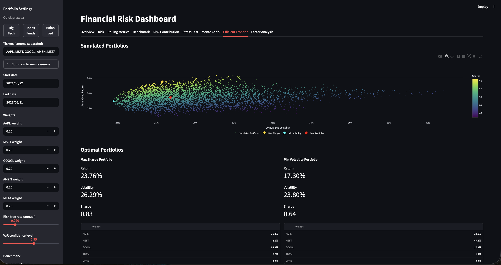

# Financial Risk Dashboard

An interactive portfolio risk analytics dashboard built with **Python** and **Streamlit** — pulls live market data via `yfinance` and computes standard risk/return metrics (returns, volatility, Sharpe ratio, Value at Risk, drawdown) for any user-defined multi-asset portfolio.


<!-- Replace the path above with an actual screenshot of the running dashboard, e.g. docs/screenshot.png -->

## Features

- **Live data ingestion** from Yahoo Finance via `yfinance` (adjusted close prices, single or multiple tickers)
- **Daily & cumulative returns** for every asset in the portfolio
- **Annualised volatility** to quantify risk per asset and at the portfolio level
- **Sharpe ratio** for risk-adjusted return, with a user-configurable risk-free rate
- **Historical Value at Risk (VaR)** at a user-selectable confidence level
- **Maximum drawdown** and full drawdown time series
- **Portfolio-level analysis** with custom, user-defined asset weights
- **Correlation heatmap** across all selected assets
- **Interactive Streamlit dashboard**: date range selection, dynamic weight inputs, risk-free rate and VaR confidence sliders, Plotly charts, and KPI metric cards

## Tech Stack

`Python` · `Streamlit` · `Pandas` · `NumPy` · `Plotly` · `yfinance`

## Risk Metrics Explained

**Volatility** — The standard deviation of daily returns, scaled to an annual figure (`std × √252`). It measures how much an asset's returns fluctuate; higher volatility means greater uncertainty/risk.

**Sharpe Ratio** — `(annualised return − risk-free rate) / annualised volatility`. It tells you how much excess return you're earning per unit of risk taken. A higher Sharpe ratio means better risk-adjusted performance.

**Value at Risk (VaR)** — An estimate of the worst expected loss over one day, at a given confidence level (e.g. 95%), based on the historical distribution of returns. For example, a 1-day 95% VaR of 2% means there's a 5% chance of losing more than 2% in a single day, based on historical data.

**Maximum Drawdown** — The largest peak-to-trough decline in cumulative portfolio value over the observed period. It captures the worst-case loss an investor would have experienced if they bought at the top and sold at the bottom.

**Correlation** — A measure (between -1 and 1) of how two assets' returns move together. Low or negative correlation between holdings is a key driver of diversification benefits in a portfolio.

## How to Run Locally

```bash
# 1. Clone the repository
git clone https://github.com/<your-username>/financial-risk-dashboard.git
cd financial-risk-dashboard

# 2. Create and activate a virtual environment
python3 -m venv venv
source venv/bin/activate   # on Windows: venv\Scripts\activate

# 3. Install dependencies
pip install -r requirements.txt

# 4. Run the Streamlit app
streamlit run app.py
```

The app will open automatically in your browser, or you can navigate to **http://localhost:8501**.

## Live Demo

🔗 [Live Demo](https://financial-risk-dashboard-bucqq6dw7fuqy4u8mdpnln.streamlit.app)

## Project Structure

```
financial-risk-dashboard/
├── app.py                 # Streamlit dashboard (UI + charts + KPIs)
├── src/
│   ├── data_loader.py     # yfinance data download & cleaning
│   └── metrics.py         # risk/return metric calculations
├── requirements.txt
└── README.md
```

## Disclaimer

This project is for educational and portfolio-demonstration purposes only. It does not constitute financial advice.
